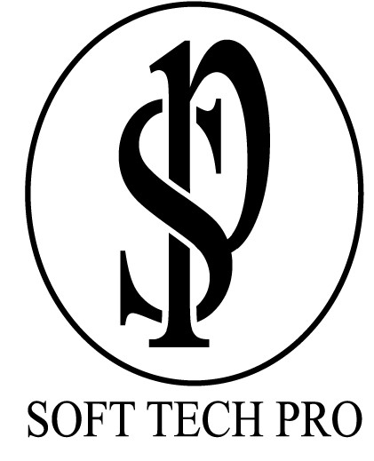

	 

<h1 align="center">Soft Tech Pro</h1>
<h3 align="center">Web Developer | Flutter Developer| Python Developer </h3>

	

Soft Tech Pro is a startup and we want to make it a bigger and better softwarehouse (Inshallah) which can make web/mobile/destop applications & websites on new technologies.

 Our aim is to provide better facilities to the costumer to get his/her goals easily and to become a good competitor in the fast growing mordern world in his/her domain.

<h1 align="center">Work Experience</h1>

<!-- OBE -->

	

<h3 align="center">OBE Based FYP Management System</h3>

OBE (Outcome-Based Education) based FYP (Final Year Project)
Management System for evaluation of Final year projects on an
automated online system using website and mobile application.This project/product is for the company
 <a href="http://www.letsinnovate.net/">“LETS INNOVATE” </a>

	<code>Ionic</code>
	<code>Html</code>
	<code>CSS</code>
	<code>Bootstrap</code>
	<code>JavaScript</code>
	<code>PHP</code>
	

<h4 align="center">App</h4>

<h4 align="center">Web</h4>

<!-- OBE -->
 

<!-- GM Project 1 -->
 
<h3 align="center">DeepNews: News Analytics using Senti-mental and Polarity Analysis</h3>

The purpose of developing this “DeepNews: News Analytics using Sentimental and Polarity Analysis” is to bring up the polarity to the world because DeepNews aim to provide in depth analysis or give polarity information about a news article.

	<code>Python</code>
	<code>Django</code>
	<code>MongoDB</code>
	<code>Javascript</code>
	<code>css</code>
	<code>Bootstrap</code>
	<code>Scrapy</code>
	<code>Selenium</code>
	<code>Beautiful Soup</code>
	 
	<code>Machine learning algorithms  SVM, Naive Base, Baysian and logistic regression</code>

<!-- GM Project 1 -->
 

<!-- Arham Project 1 -->
 
<h3 align="center">Skin lesion detection using deep learning</h3>

There were different fyps offered by university buy the one which caught our interest was skin lesion detection using deep learning a research based fyp in which we differentiated between melanoma nevus and serboheic keratosis. we read several articles and generated a custom architecture we tried our best to get the best accuracy as possible and our results were astounding even through lack of resources we achieved an accuracy of over 85%

 
<!-- Arham Project 1 -->

